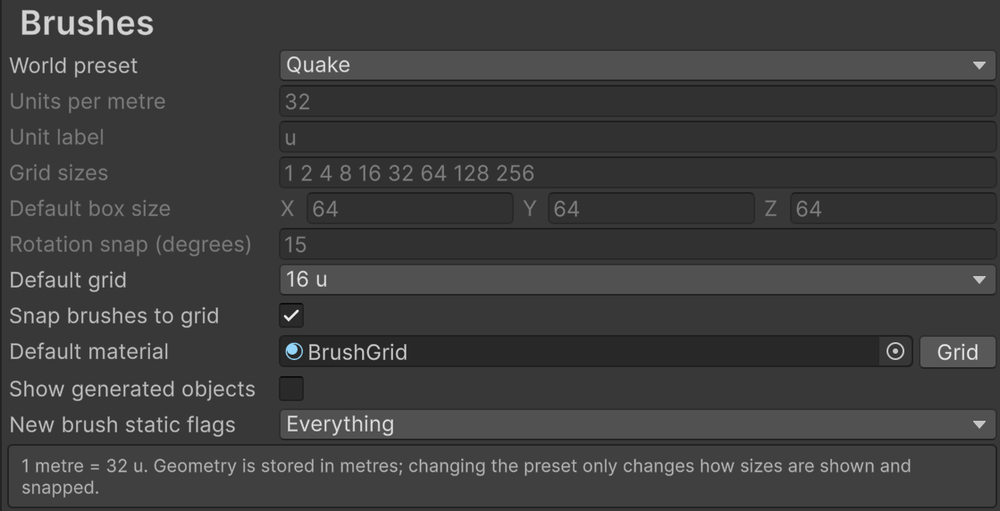
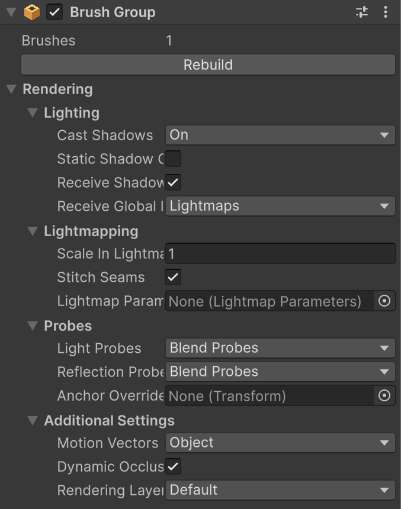

# Brush Group rendering and lightmapping

CSG Brush builds the brushes under a **Brush Group** into render meshes and colliders. Brushes that aren't under a Brush Group are built by the scene's automatic group. This page explains how static flags, renderer settings, and lightmap UVs apply to that output.

## Static flags

Each brush's static flags control its own geometry. Set them with the **Static** checkbox or dropdown at the top of the Inspector, as for any GameObject.

* The brush's colliders take its static flags.
* The brush's faces render in a mesh with the same static flags. Static brushes batch, occlude, and receive lightmaps. Brushes that aren't static render in a separate mesh, so you can move or animate them.
* Static and non-static brushes still carve each other. The faces that a cut creates, such as the sides of a doorway, take the static flags of the brush they're cut into.

New brushes and Floor Plans start with the static flags set in **Project Settings** > **Brushes** > **New brush static flags**.

> [!NOTE]
> The static flags of the Brush Group GameObject itself don't affect its meshes.

## Renderer settings

The **Rendering** section of the Brush Group Inspector holds the settings of a Mesh Renderer. Every render mesh of the group uses them. The materials come from the brushes.

To change the renderer settings of a group:

1. Select the GameObject with the **Brush Group** component.
2. In the Inspector, expand **Rendering**.
3. Change the settings. The group's meshes update immediately.

The defaults match a new Mesh Renderer, so a group you don't change, and the scene's automatic group, render with Unity's defaults.

## Lightmap UVs

Static brushes that contribute to global illumination need lightmap UVs. CSG Brush doesn't generate them while you build, because unwrapping large meshes is slow.

Lightmap UVs are generated in two ways:

* Choose **Tools** > **CSG Brush** > **Generate Lightmap UVs**.
* Start a light bake. If a lit brush mesh doesn't have lightmap UVs, CSG Brush stops the bake, generates them, and starts the bake again.

Any change to a brush mesh removes its lightmap UVs, and the next bake generates them again.

To control lightmap texel density, set **Scale In Lightmap** in the group's **Rendering** section. Use separate Brush Groups for areas that need different densities.

## Brush Group component reference

| **Property** | **Description** |
| :--- | :--- |
| **Brushes** | The number of brushes the group builds. |
| **Rebuild** | Builds the group's meshes and colliders again from scratch. For a group in a prefab, this rebuilds the prefab. |

### Rendering

#### Lighting

| **Property** | **Description** |
| :--- | :--- |
| **Cast Shadows** | Whether and how the meshes cast shadows: **Off**, **On**, **Two Sided**, or **Shadows Only**. |
| **Static Shadow Caster** | Casts shadows into cached shadow maps only once, for static lights. |
| **Receive Shadows** | Receives shadows from other objects. |
| **Receive Global Illumination** | Whether static meshes that contribute to global illumination receive it from **Lightmaps** or **Light Probes**. |

#### Lightmapping

| **Property** | **Description** |
| :--- | :--- |
| **Scale In Lightmap** | The lightmap texel density relative to the rest of the scene. **2** is twice as sharp, **0.5** is half. |
| **Stitch Seams** | Blends lightmap seams where faces meet. |
| **Lightmap Parameters** | A Lightmap Parameters asset. When empty, the meshes use the scene's default. |

#### Probes

| **Property** | **Description** |
| :--- | :--- |
| **Light Probes** | How meshes that aren't lightmapped use light probes. |
| **Reflection Probes** | How the meshes use reflection probes. |
| **Anchor Override** | The point where probes are sampled. When empty, each mesh uses the centre of its bounds. |

#### Additional Settings

| **Property** | **Description** |
| :--- | :--- |
| **Motion Vectors** | The motion vectors mode, for motion blur and temporal effects. |
| **Dynamic Occlusion** | Hides the meshes when they're occluded, even if they aren't static. |
| **Rendering Layer Mask** | The rendering layers the meshes are on, for light layers and decal layers. |

## Additional resources

* [Lightmapping](https://docs.unity3d.com/Manual/Lightmappers.html) in the Unity Manual
* [Mesh Renderer component](https://docs.unity3d.com/Manual/class-MeshRenderer.html) in the Unity Manual
