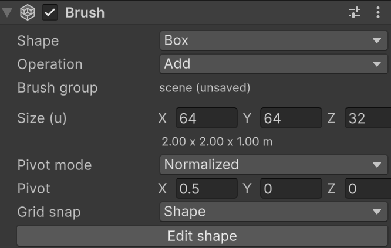
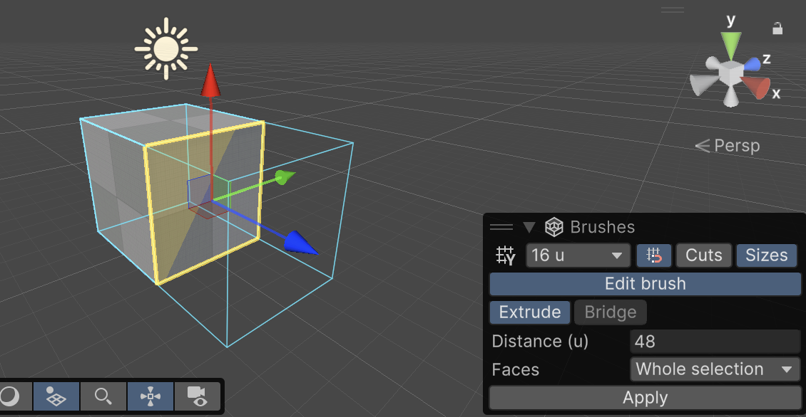

# Brush reference

A brush is a GameObject with a **Brush** component. It describes a solid shape: a box, a cylinder, a flight of stairs, or a shape you edit by hand. CSG Brush combines the brushes of a scene into render meshes and convex colliders. A brush has nothing hidden under it; the meshes and colliders are generated under the [Brush Group](#brush-groups-and-prefabs) that builds it.

This page describes brushes in detail. For floor plans, doors and windows, wall anchors, and rendering, see [Additional resources](#additional-resources).

## Create a brush

To draw a brush in the Scene view:

1. In the Scene view toolbar, open the **Create** tool dropdown and select a shape.
2. Optional: In the **Brushes** overlay, set what the new brush gets, such as its operation, modules, number of sides, step height, or **Hollow**.
3. Press on a surface, a brush face, or the ground, and drag out the base.
4. Release, then move the pointer to set the height.
5. Click to create the brush.

Press **Esc** to cancel the brush, or to leave the tool.

Everything snaps to the grid. If you start on a wall, the brush grows out of the wall. While you draw, the Scene view shows the width and depth of the base, then the height. To hide these sizes, turn off **Sizes** in the **Brushes** overlay.

Some shapes are drawn differently:

| **Shape** | **How to draw it** |
| :--- | :--- |
| **Box**, **Wedge**, **Linear Stairs**, **Arch** | Drag the base rectangle, then set the height. |
| **Cylinder**, **Cone**, **Sphere** | Press on the centre of the base, drag the radius, then set the height. A sphere with no height is round; lift it to make an ellipsoid. |
| **Curved Stairs**, **Spiral Stairs** | Press where the column's axis goes and drag the outer radius. The drag direction is where the first step starts. Then set the height. The brush's transform is on the axis, at floor level. |
| **Door**, **Window** | Click once. See [Doors and windows](doors-and-windows.md). |
| **Floor Plan** | Click the corners of the walls. See [Floor plans](floor-plans.md). |

A new brush starts with the settings shown in the **Brushes** overlay while the Create tool is active; the project keeps them between sessions. After you create a brush, change them on the brush itself. Its static flags come from **Project Settings** > **Brushes** > **New brush static flags**.

You can also create a brush in these ways:

* **Tools** > **CSG Brush** > **Create** selects a shape in the Create tool.
* **GameObject** > **Brush** creates a brush of the default size at the centre of the Scene view.
* Add a **Brush** component to an empty GameObject.

## Place, size, and rotate a brush

Use the **Move** and **Rotate** tools as for any GameObject. Set the brush's **Size** in the Inspector, in the units of the world preset; the size in metres is shown below it.

The **Scale** tool also resizes the brush. When you release it, the scale goes into the brush's **Size** and the transform's scale returns to one.

### Grid snapping

With **Snap to grid** on in the **Brushes** overlay (the default), brushes stay on the world grid:

* A brush's size is a multiple of the grid step.
* Its rotation snaps to fixed angles.
* It has no scale.

When you move or resize a brush, its **Grid snap** setting decides what goes onto the grid:

| **Grid snap** | **What goes onto the grid** | **Use it for** |
| :--- | :--- | :--- |
| **Shape** | The brush's outermost vertices: the corner of its bounds. An axis-aligned brush has its faces on grid lines, so brushes meet cleanly. This is the default. | The classic brush workflow, and collision geometry. |
| **Pivot** | The brush's pivot. The shape follows, wherever it ends up. | The ProBuilder workflow, such as detail brushes placed around a point. |

Either way, rotating a brush never moves it: it turns about its pivot, and only the angle snaps. The next time you move it, it snaps again. An undo, setting the pivot, and opening a scene don't move brushes either. Vertices you move in [edit mode](#edit-a-brushs-shape) snap to the grid in both modes; a Custom shape in **Shape** mode also puts its vertices on the grid while it's axis-aligned.

Set **Grid snap** in the Brush Inspector. New brushes get the setting in the **Brushes** overlay while a Create tool is active.

Press **[** and **]** to change the grid step. Doors, windows, and brushes on a [wall anchor](wall-anchor.md) don't snap, because their wall places them.

Parent GameObjects may only organise brushes. If a brush's parent is rotated or scaled, the **Brushes** overlay lists it with a **Reset** button.

### World presets

**Project Settings** > **Brushes** selects the units, the grid steps, and the default sizes:

| **Preset** | **Units** |
| :--- | :--- |
| **Unity** | Metres. This is the default. |
| **Quake** | 32 units per metre. |
| **Source**, **Unreal** | The units of those editors. |
| **Custom** | Your own units and grid steps. |

The **Brushes** overlay shows the current preset and grid step.

## Set a brush's pivot

The pivot is where the brush's transform sits inside the brush. It's measured from the brush's left, bottom, back corner, where the back is the side away from the direction the brush faces (+Z).

**Pivot mode** sets how the **Pivot** values are measured:

| **Pivot mode** | **Values** | **When you resize the brush** |
| :--- | :--- | :--- |
| **Normalized** | 0 to 1 of the brush's size on each axis. 0.5, 0.5, 0.5 is the centre, which is the default. | The pivot stays at the same fraction of the size. |
| **Absolute** | A distance from the corner, in the units of the world preset. | The pivot stays at the same distance from the corner. |

Useful pivots:

* **Y = 0** puts the pivot on the bottom face, so the brush stands on whatever you place it on.
* **Y = 0 and Z = 0** put the pivot at the bottom of the back face, so the brush stands against a wall. Use this for furniture on a [wall anchor](wall-anchor.md#stand-an-object-away-from-the-wall).

Setting the pivot moves the transform, never the shape. Switching the pivot mode doesn't move anything. On a Custom shape, setting the pivot moves the vertices instead.

Curved and spiral stairs, doors, and windows don't have a pivot setting, because their placement depends on their transform.

## Add and subtract

A brush's **Operation** is **Add** or **Subtract**. An added brush fills space; a subtract brush carves it out.

The Hierarchy order is the CSG order. A subtract brush carves only the brushes above it in the Hierarchy, so a brush you create after a cutter stays whole until you move it above the cutter. To change the order, drag brushes in the Hierarchy, or use **To First** and **To Last** in the Brush component's context menu.

Turn on **Cuts** in the **Brushes** overlay to see subtract brushes as translucent red volumes. This lets you select a subtract brush where it has carved everything away. With **Cuts** off, you can't click subtract brushes in the Scene view, except doors and windows.

### Layers

Brushes are combined per Unity layer. A subtract brush carves only brushes on its own layer, and each layer renders as its own mesh and has its own colliders on that layer. Use layers for a collision layer per kind of thing, or to keep parts of a level from carving each other.

## Edit a brush's shape

Every shape can be edited by hand. To start editing, click **Edit shape** in the Brush Inspector or **Edit brush** in the **Brushes** overlay, or select **Edit Brush** in the tool context dropdown of the Scene view's Tools overlay.

In edit mode, the Tool Settings toolbar holds the selection settings:

| **Setting** | **Description** |
| :--- | :--- |
| **Vertex**, **Edge**, **Face** | What you select. Press **1**, **2**, or **3** to switch. |
| **Select Hidden** | Also select vertices, edges, and faces that face away from the camera. |
| **Drag Rectangle Mode** | Select only what's completely inside the rectangle, or everything it touches. |
| Handle orientation | **Global**, **Local**, or **Element**. **Element** aligns the gizmo with the selection, so the blue axis runs along a face's normal. |

To select, click an element. Shift-click adds to the selection, Ctrl-click removes from it, and dragging a rectangle selects several. **Esc** clears the selection.

The **Move**, **Rotate**, and **Scale** tools act on the selection, snapped to the grid. Vertices that you drop onto each other weld together.

The first edit turns the brush into a **Custom** shape. **Reset to Box** (or to the shape the brush came from) discards your edits. Concave shapes are allowed; CSG Brush splits them into convex parts for the colliders.

### Extrude

To extrude:

1. Select one or more faces.
2. In the **Brushes** overlay, turn on **Extrude**. The extrude settings appear under it, and the Scene view outlines the extruded shape.
3. Set the **Distance**. A negative distance cuts a pocket into the brush. The outline follows as you change it.
4. In **Faces**, choose whether the selection extrudes as one block or each face on its own.
5. Click **Apply**.

Nothing changes until you click **Apply**. The faces stay selected, so **Apply** again extrudes them again. If the extrusion can't be made, the overlay says why instead of enabling **Apply**. You can also hold **Shift** when you start dragging the **Move** gizmo on selected faces: they extrude by the distance you drag. Drag into the brush to cut.

An extrusion can run through other parts of the brush. Your own faces, edges, and vertices survive it, so coplanar faces you keep apart stay apart, and per-face materials stay where they were.

### Bridge

**Bridge** connects two selected faces of one brush with a block between them, the way a corridor joins two rooms. The faces need the same number of corners. The new walls stay selected.

If an extrusion or bridge wouldn't make a sound shape, for example because it would end exactly where the brush touches itself, or a cut would remove everything, the brush stays as it was and the **Brushes** overlay says why. Try another distance.

## Materials

A brush's **Material** applies to every face of the brush.

To set a material, you can also drag it from the Project window onto a brush in the Scene view. While you drag, the Scene view outlines the brushes the material will go to. On a [Floor Plan](floor-plans.md), the material goes to all of the plan's walls, or to the floor or ceiling of the one room under the pointer. A regular mesh in front of a brush takes the material the usual Unity way.

The faces a subtract brush carves take the subtract brush's material. For example, the sides of a doorway can have a different material from the wall.

Faces without a material show a generated ruler texture: lines at every grid step, stronger at each metre, on a metre checker. It lines up with the world grid across brushes and cuts. CSG Brush creates it under `Assets/CSG Brush` the first time it's needed. To use your own material instead, set it in **Project Settings** > **Brushes**.

## Collision and triggers

**Collision** sets what colliders the brush makes:

| **Collision** | **Result** |
| :--- | :--- |
| **Solid** | Solid colliders. |
| **Trigger** | Trigger colliders. |
| **None** | No colliders. |

A brush's colliders are convex pieces. Each piece takes the brush's **Physics Material**, **Provide Contacts** setting, tag, layer, and static flags.

A trigger brush made of several pieces still raises one enter and one exit per collider. To react to triggers, do one of the following:

* Put a script with `OnTriggerEnter`, `OnTriggerStay`, or `OnTriggerExit` on the brush, as on any trigger.
* Subscribe to `Brush.TriggerEntered` and `Brush.TriggerExited`.
* Implement `IBrushTriggerListener` in a component on the brush's GameObject.
* Add the **Brush Trigger** module and connect its UnityEvents.

### Modules

A module carries the game-specific values of a surface, such as ice, water, or fall damage. A module is a `BrushModule` component on the brush, or on a parent GameObject, where it applies to every brush below it. Its values go onto each collider piece of the brush, and changing them rebuilds only those pieces. A module can also make a brush a trigger, for example for water.

To give every new brush a module, turn the module on under **Modules** in the **Brushes** overlay while the Create tool is active. The Quake controller's module, `QuakeBrushSurface`, is part of the project, not of this package.

## Shape settings

### Hollow

**Hollow** turns a box or cylinder into a room: only walls of **Wall thickness** remain.

### Stairs

You set the step height and draw the total height. The number of steps is the height divided by the step height, rounded, so the steps fill the height exactly.

* **Linear Stairs** fill their size box. Each step runs the length divided by the number of steps.
* **Curved Stairs** and **Spiral Stairs** use Unreal's parameters: inner radius, step width, step height, angle of the curve or steps per 360 degrees, add to first step, and counter clockwise. Spiral stairs also have step thickness, sloped floor, and sloped ceiling. You set a height instead of a number of steps, and the brush's size follows from the parameters.

Linear and curved stairs stand on solid support down to the floor. Turn off **Support under steps** for open steps, each a slab of **Step thickness**. Set it on the brush, or in the **Brushes** overlay for new stairs.

Each step is a closed block with its own convex collider. A sloped spiral's collider is the hull of each twisted block, so use more steps per turn for a smoother ramp.

## Brush groups and prefabs

A **Brush Group** component builds the brushes below it in the Hierarchy, down to the next group, into one mesh per layer and one set of colliders. These are generated as the group's children. To add one, choose **Add Component** > **CSG Brush** > **Brush Group**. A group has an amber block icon in the Hierarchy and the Scene view.

A brush is built by the nearest group above it. Brushes without one are built by their scene's automatic group, which is hidden. Every scene has its own, so every scene holds its own geometry and scenes can be loaded together at runtime. The **Brush group** field in the Brush Inspector shows what builds the brush; click it to find the group.

A Brush Group inside a prefab builds into the prefab: its meshes are saved as sub-assets whenever you save the prefab. You can instantiate such a prefab at runtime, and it never carves anything outside itself. Instances in a scene use the prefab's meshes until you change their brushes.

A prefab without a Brush Group is a stamp. When you place it in a level in the editor, its brushes, such as a doorway cut, join that level's CSG. It builds nothing of its own.

For static flags, renderer settings, and lightmap UVs, see [Brush Group rendering and lightmapping](brush-group-rendering.md).

## Rebuild

CSG Brush builds automatically when you change a brush. To build everything again from scratch, meshes and colliders, choose **Brushes** > **Rebuild Now**.

## Run the package tests

Open **Window** > **General** > **Test Runner**, select **EditMode**, and run `CsgBrush.Tests`. To run them from the command line, use `-runTests -testPlatform EditMode -testFilter CsgBrush.Tests`.

## Additional resources

* [Floor plans](floor-plans.md)
* [Doors and windows](doors-and-windows.md)
* [Attach objects to walls](wall-anchor.md)
* [Brush Group rendering and lightmapping](brush-group-rendering.md)
