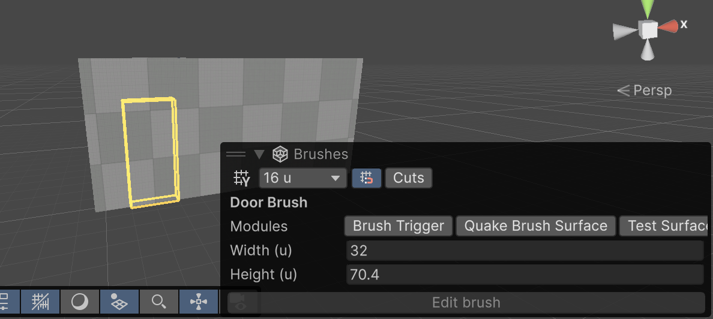
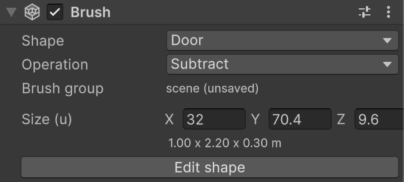

# Doors and windows

**Door** and **Window** are brush shapes that cut an opening of a set size. They're always subtract brushes, and they never snap to the grid.

| **Shape** | **Default size** | **Bottom edge** |
| :--- | :--- | :--- |
| **Door** | 1 × 2.2 m | On the floor. |
| **Window** | 1.2 × 1.2 m | 0.9 m above the floor (the sill). |

A door or window can cut any brush, but it works best on a [Floor Plan](floor-plans.md) wall. There it follows the wall when you edit the Floor Plan, and its depth always matches the wall's thickness.

## Place a door or window

To place a door or window:

1. In the Scene view, open the **Create** tool dropdown and select **Door Brush** or **Window Brush**.
2. Optional: In the **Brushes** overlay, set the **Width** and **Height**. For a window, also set the **Sill**.
3. Move the pointer over a wall. An outline shows where the opening goes.

    

4. Click to place the opening.

Where the opening goes depends on what's under the pointer:

| **Under the pointer** | **Result** |
| :--- | :--- |
| A Floor Plan wall | The opening slides along the wall, snapped to the grid. It becomes a child of the Floor Plan and gets a [Wall Anchor](wall-anchor.md). |
| The side of another brush | The opening cuts through that brush and stands on its bottom. |
| The floor or the grid | The opening stands on the floor and faces the view. |

You can also select a Floor Plan and use **GameObject** > **Brush** > **Door** or **Window** to place an opening in the middle of its first wall.

## Change a door or window

A door or window is an ordinary brush. Its **Size** in the Brush Inspector sets its width, height, and depth. On a Floor Plan wall, the depth follows the wall thickness, and the [Wall Anchor](wall-anchor.md) sets where the opening sits along the wall and how high.

To move an opening along its wall, use the **Move** tool. The opening snaps back onto the nearest wall. If you drag it far from every wall, it stays where you put it as a free cut.

## Additional resources

* [Attach objects to walls](wall-anchor.md)
* [Floor plans](floor-plans.md)
