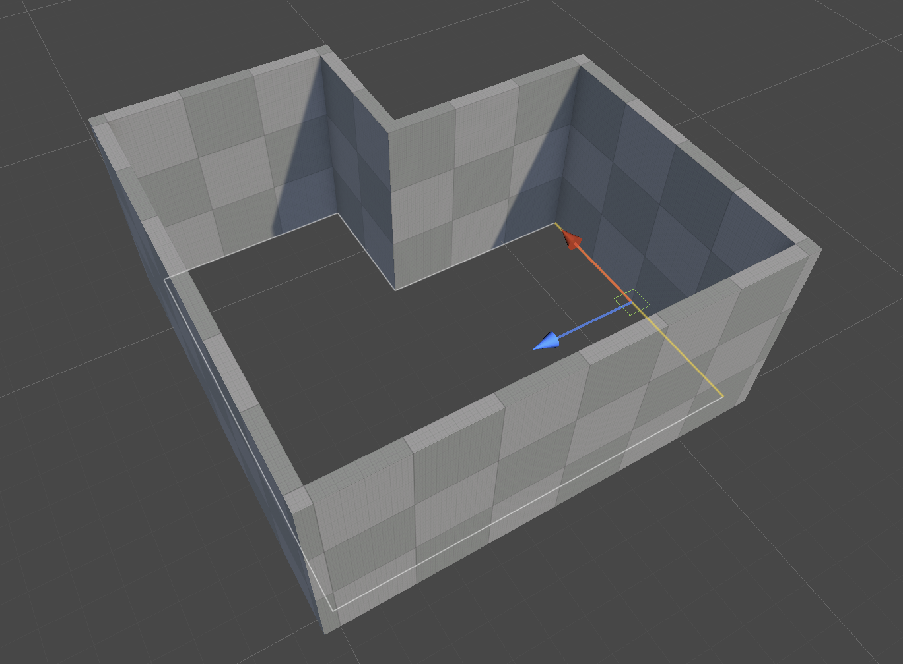

# Edit a floor plan

Floor plan edit mode lets you select and transform the points and walls of a Floor Plan. It works like the Edit Brush mode for brushes: while it's active, Unity's **Move**, **Rotate**, and **Scale** tools act on the selected points or walls instead of the GameObject.

To enter edit mode, select a Floor Plan and do one of the following:

* Click **Edit** in the Floor Plan Inspector.
* Click **Edit plan** in the **Brushes** overlay.
* Select **Edit Floor Plan** in the tool context dropdown of the **Tools** overlay.

To leave edit mode, click **Edit** again, or right-click in the Scene view and select **Stop Editing**.

## Select points and walls

Edit mode has two selection modes:

| **Mode** | **Shortcut** | **Selects** |
| :--- | :--- | :--- |
| **Vertex** | **1** | The points. |
| **Edge** | **2** | The walls. Each wall runs between two points. |
| **Room** | **3** | The rooms. Click inside a room to select it; its floor and ceiling settings appear in the Inspector. |

| **Action** | **Result** |
| :--- | :--- |
| Click | Selects the point or wall under the pointer. |
| **Shift**+click | Adds to the selection. |
| **Ctrl**+click (macOS: **Cmd**+click) | Removes from the selection. |
| Drag a rectangle | Selects every point or wall inside the rectangle. The **Drag Rectangle Mode** toolbar setting decides whether a wall must be completely inside or only touch the rectangle. |
| **Ctrl**+**A** (macOS: **Cmd**+**A**) | Selects everything. |
| **Ctrl**+**I** (macOS: **Cmd**+**I**) | Inverts the selection. |
| **Esc** | Clears the selection. |

> [!NOTE]
> If the Scene view doesn't have keyboard focus, the **2** key toggles Unity's 2D view instead of Edge mode. Click in the Scene view first.

## Transform the selection

All transforms stay on the floor of the Floor Plan:

* **Move** moves along the two floor axes, or freely on the floor with the square handle.
* **Rotate** turns the selection around its centre. Drag the ring on the floor.
* **Scale** scales along one floor axis, or along both with the centre cube.

Points snap to the grid, and rotation snaps to the rotation snap angle. When you move or rotate a wall, its two corners move with it and the neighbouring walls stretch to follow.

The **Handle Orientation** toolbar setting aligns the gizmo with the world axes (**Global**), the Floor Plan axes (**Local**), or the selected wall (**Element**).

## Add and move points

In Vertex mode, a light blue plus sign appears in the middle of every wall.

* Click a plus sign to add a corner in the middle of that wall.
* Drag a plus sign to add a corner and move it in one step.
* Drag any corner to move it without selecting it first. If the corner is part of a selection, the whole selection moves.

## Delete points and walls

To delete, select points or walls and press **Delete** or **Backspace**, or right-click and select **Delete**.

| **What you delete** | **Result** |
| :--- | :--- |
| A point between two walls | The two walls become one wall between the neighbouring points. |
| A point where three or more walls meet | The point and all its walls are removed. |
| A wall | The wall is removed, along with any point no other wall uses. A room opens where one of its walls is removed. |

You can't delete the last wall of a Floor Plan. To remove the whole Floor Plan, leave edit mode and delete the GameObject.

## Additional resources

* [Floor plans](floor-plans.md)
