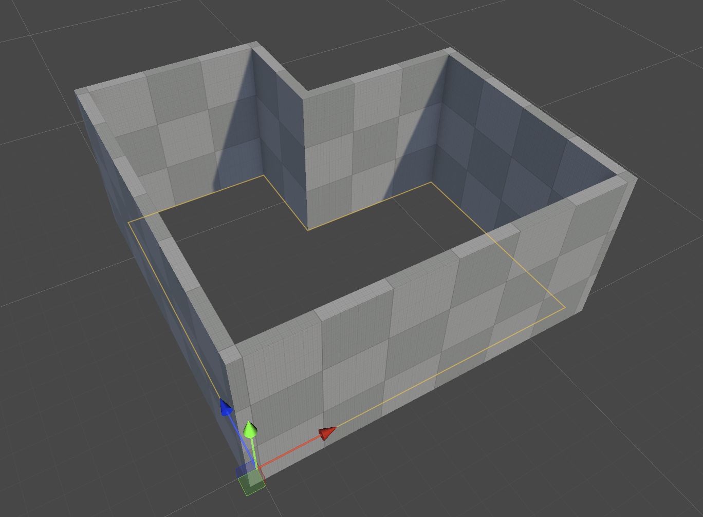
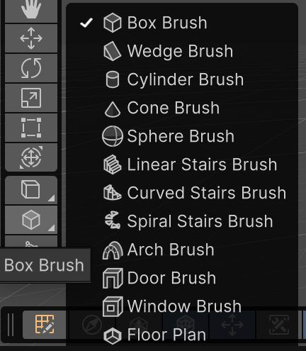
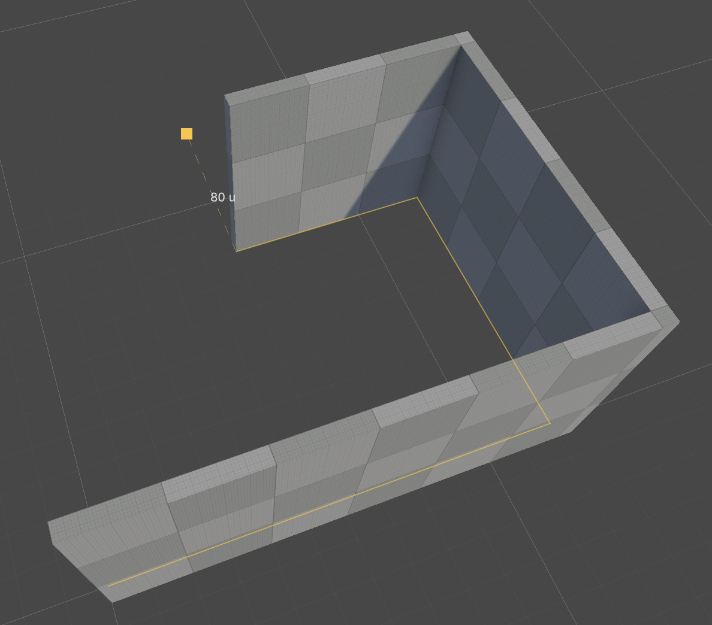
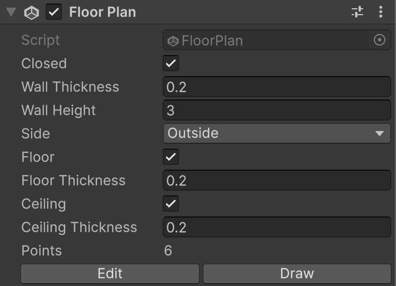
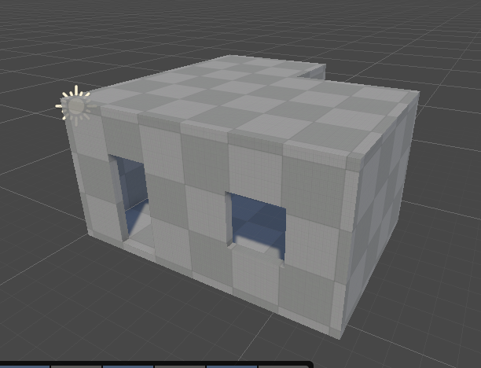

# Floor plans

A **Floor Plan** is a network of walls drawn on the floor. Points are joined by walls, and a point can join any number of walls, so the outside walls and the interior walls belong to the same plan. Walls that end on or cross another wall are joined there without gaps. Every area the walls enclose is a room, with its own floor and ceiling.

The walls are generated brushes. They're hidden in the Hierarchy, and when you click a wall in the Scene view, Unity selects the Floor Plan. When you change the outline or the Floor Plan properties, the walls update.

## Draw a floor plan

To draw a floor plan:

1. In the Scene view, open the **Create** tool dropdown and select **Floor Plan**.

    

2. Click on the floor where the first corner goes. This creates a Floor Plan GameObject and starts drawing.
3. Click to place each following corner. Each click adds a wall from the previous corner.

    

4. To close the room, click the first corner. Clicking an existing point or wall joins the new wall to it and ends the stroke.
5. To add an interior wall, click a point on a wall (the wall is split there), then click where the interior wall ends, on another wall or anywhere on the floor.
6. Press **Esc** or double-click to end a stroke, and **Enter** or **Esc** again to stop drawing.

You can also create a Floor Plan from the menu: **GameObject** > **Brush** > **Floor Plan** creates one at the Scene view pivot.

While you draw:

* Corners snap to the grid and to 45-degree angles from the previous corner.
* Hold **Shift** to place a corner on any grid point.
* Points and walls under the pointer are highlighted with a larger white marker. Clicking them joins the new wall to the plan.
* Press **Backspace** to remove the last wall of the stroke.

To continue drawing an existing Floor Plan, select it and click **Draw** in the Inspector.

## Floor Plan component reference

| **Property** | **Description** |
| :--- | :--- |
| **Wall Thickness** | The thickness of outside walls, in metres. This value doesn't snap to the grid. |
| **Interior Wall Thickness** | The thickness of walls between rooms and of free-standing walls, in metres. |
| **Wall Height** | The height of every wall, in metres. |
| **Side** | Where outside walls stand relative to the drawn line. Interior and free-standing walls are always centred on it. &#8226; **Outside**: Outside walls stand outside the line, so the line is the inner face of the rooms. This is the default. &#8226; **Centered**: Outside walls are centred on the line. &#8226; **Inside**: Outside walls stand inside the line. |
| **Wall Material** | The material of every wall. When empty, walls use the project's default material. |
| **Floor** | Rooms get a floor slab unless a room is set otherwise. Enabled by default. |
| **Floor Thickness** | The thickness of the floors, in metres, measured down from the bottom of the walls. |
| **Floor Material** | The material of floors without one of their own. |
| **Ceiling** | Rooms get a ceiling slab unless a room is set otherwise. Disabled by default. |
| **Ceiling Thickness** | The thickness of the ceilings, in metres, measured up from the top of the walls. |
| **Ceiling Material** | The material of ceilings without one of their own. |
| **Plan** | The number of points, walls and rooms. This value is read-only. |
| **Edit** | Enters [floor plan edit mode](floor-plan-edit-mode.md). |
| **Draw** | Draws more walls. |

A single wall can have its own thickness: in edit mode, select it in Wall mode and set **Thickness** in the Inspector. **0** uses the plan's outside or interior thickness.

The walls, floor, and ceiling take the layer, tag, and static flags of the Floor Plan GameObject.

## Floors and ceilings

Every room gets a floor and a ceiling slab, according to the plan's **Floor** and **Ceiling** settings. A room's slabs reach under its outside walls and to the middle of its interior walls, so the rooms are sealed whatever the **Side** setting is. The slabs follow the room's shape, including concave shapes such as an L-shaped room, and update when you edit the Floor Plan.

To give a room its own floor, ceiling or materials:

1. Select the Floor Plan and click **Edit** in the Inspector.
2. Press **3** for Room mode, and click the room. Shift-click to select more rooms.
3. In the Inspector, under **Selected rooms**, set **Floor**, **Floor material**, **Ceiling** and **Ceiling material**.

You can also drag a material from the Project window onto a floor or ceiling in the Scene view: it becomes that room's material. Dropped on a wall, a material becomes the plan's **Wall Material**. While you drag, the Scene view outlines what the material will go to.

**Use Plan Defaults** returns the selected rooms to the plan's settings. A room keeps its settings while you move walls, and when you split it with a new wall, both halves keep them.

Walls that don't enclose anything, such as a single free-standing wall, have no room and so no floor or ceiling.

> [!NOTE]
> A ceiling hides the room from above in the Scene view. To work inside the room, disable **Ceiling** while you edit, or look in from the side.

## Additional resources

* [Edit a floor plan](floor-plan-edit-mode.md)
* [Doors and windows](doors-and-windows.md)
