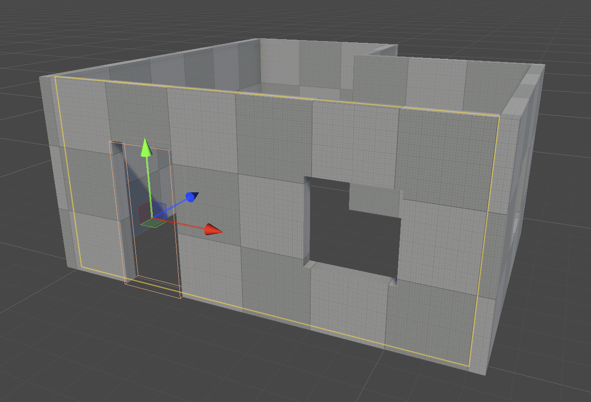
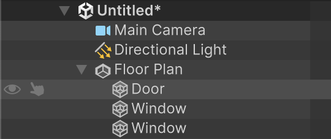
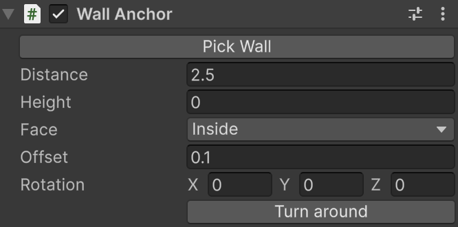

# Attach objects to walls

A **Wall Anchor** keeps an object on a wall of a Floor Plan. When the wall moves, turns, gets thicker, or is split, the object follows. Doors and windows get a Wall Anchor automatically. You can also attach any other GameObject, such as a prefab, a light, or a brush.

An anchored object is a child of its Floor Plan. When you select it, the Scene view outlines its wall in yellow.

## Attach an object

To attach an object to a wall, do one of the following:

* Select the object and choose **GameObject** > **Brush** > **Attach to Wall**. The object moves under the nearest Floor Plan and attaches to its nearest wall. It keeps its position and turns to line up with the wall: its front (+Z) faces out of the wall, and up is up.
* Draw a brush on the face of a Floor Plan wall with the **Create** tool. The brush keeps the pose you drew it with.
* Add a **Wall Anchor** component to a child of a Floor Plan.

To detach an object, select it and choose **GameObject** > **Brush** > **Detach from Wall**. The object leaves the Floor Plan and stays where it is.

## Move an object to another wall

To move an anchored object to another wall:

1. In the Wall Anchor Inspector, click **Pick Wall**.
2. In the Scene view, move the pointer over walls. The wall under the pointer is outlined in white.
3. Click a wall. The object moves onto it and keeps its distance along the wall, height, offset, and rotation relative to the wall.

Press **Esc** to cancel. The wall can belong to another Floor Plan. The object then moves under that Floor Plan.

You can also move an anchored object with the **Move** tool. It slides along its wall at its offset, or attaches to another wall when you drop it against one, lined up with that wall. If you drag it further out from its wall than its offset, it's freed and stays where you put it. A freed object attaches again when you drop it against a wall.

## Turn an object on its wall

An anchored object faces out of its wall: into the room on the **Inside** face, away from the building on the **Outside** face. When you switch the face, the object turns to face out of the new side. On a **Centered** object, either side is valid; it faces the wall's outer side, and **Turn around** turns it to the other.

If a model faces the wrong way, click **Turn around** in the Wall Anchor Inspector, or type a **Rotation** relative to the wall. For example, 0, 90, 0 fixes a model whose front points along its X axis. Rotating the object with the **Rotate** tool sets the same value.

## Stand an object away from the wall

To keep furniture or other objects a set distance from the wall, set **Offset** in the Wall Anchor Inspector. The offset is measured from the wall face to the object's pivot, so put the pivot at the back of the object: for a prefab, its modeller sets it; for a brush, set the brush's **Pivot** Z to 0 (see [Brush reference](brush-reference.md)). With Offset at 0, the object's back touches the wall. A typed offset never frees the object, however large it is.

## What happens when a wall changes

| **Change** | **Result** |
| :--- | :--- |
| The wall moves or turns | The object moves with the wall and keeps its pose relative to the wall face. |
| The wall gets thicker, or the Floor Plan **Side** changes | The object stays against the wall face. A door or window stays cut all the way through. |
| A corner is added in the wall, or another wall joins it | The object stays where it was, on the part of the wall it's on. |
| The wall is deleted | The object stays where it was and is no longer attached. |

## Wall Anchor component reference

| **Property** | **Description** |
| :--- | :--- |
| **Pick Wall** | Click, then click a wall in the Scene view to attach the object to it. |
| **Distance** | The distance along the wall from its first corner, in metres. |
| **Height** | The height above the floor, in metres. For a door or window, this is the height of its bottom edge. For other objects, it's the height of the pivot. |
| **Face** | Where on the wall the object is: on its **Outside** face, **Centered** in it, or on its **Inside** face, as a Floor Plan's **Side**. Doors and windows don't have this property, because they always cut through the wall. |
| **Offset** | The distance from the wall face to the object's pivot, out of the wall, in metres. Doors and windows don't have this property. |
| **Rotation** | The object's rotation relative to the wall, in degrees. At 0, 0, 0 its front (+Z) faces out of the wall and up is up. Doors and windows don't have this property. |
| **Turn around** | Turns the object 180 degrees about the wall's up axis. |

Brushes that an anchored object carries don't snap to the grid, so they stay aligned with walls at any angle.

## Additional resources

* [Doors and windows](doors-and-windows.md)
* [Floor plans](floor-plans.md)
