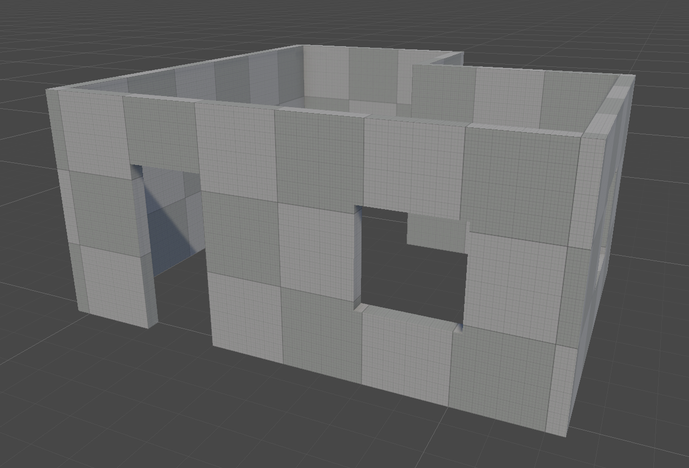

# CSG Brush

A brush-based level editor for Unity, modelled on the Quake and Unreal level editors. Levels are built from convex
brushes that are added to or subtracted from each other. The package generates the render meshes and convex colliders
from the brushes in the editor.

It was written for teaching level design and character controllers, so the toolset is small, brushes snap to a world
grid, and colliders are made of convex pieces.

## Features

- Brush shapes: box, wedge, cylinder, cone, sphere, arch, and linear, curved and spiral stairs, drawn in the Scene view
  with the Create tool.
- Additive and subtractive brushes, combined in Hierarchy order using the [Manifold](https://github.com/elalish/manifold)
  library.
- Grid snapping of position, size and rotation, in metres or Quake units.
- Vertex, edge and face editing with move, rotate, scale and extrude.
- Floor plans: an outline that generates walls, a floor and a ceiling.
- Door and window brushes that cut openings of a set size.
- Wall anchors that keep doors, windows and other objects attached to floor plan walls.
- One convex collider per brush piece, with trigger, physics material and module support.
- Static flags per brush, renderer settings per Brush Group, and lightmap UV generation.
- Brush Groups that build into prefabs and scenes.

The package is editor-only. Builds contain only the generated meshes and colliders.

## Requirements

- Unity 6000.6 or later.
- macOS on Apple Silicon for editing. The CSG library is a native editor plugin; the Windows and Linux builds aren't included yet.

## Install

1. In Unity, open **Window** > **Package Manager**.
2. Click **+** and select **Install package from git URL**.
3. Enter `https://github.com/jaroslavstehlik/csg-brush.git` and click **Install**.

To install a specific version, add a tag to the URL, for example `https://github.com/jaroslavstehlik/csg-brush.git#v0.2.0`.

## Documentation

- [Manual](Documentation~/index.md): floor plans, doors and windows, wall anchors, and rendering and lightmapping.
- [Brush reference](Documentation~/brush-reference.md): detailed notes on the brush tools and components.
- [Changelog](CHANGELOG.md)

## Development

This project is developed and maintained by AI coding agents (Claude Code), directed by the author. Changes are
checked with the package's EditMode test suite. See [CONTRIBUTING.md](CONTRIBUTING.md).

## Support this project

CSG Brush is free to use under the MIT license. Maintenance and new features can be supported through
[GitHub Sponsors](https://github.com/sponsors/jaroslavstehlik).

## License

CSG Brush is released under the [MIT license](LICENSE). It includes the [Manifold](https://github.com/elalish/manifold) library, released under the Apache License 2.0; see [LICENSE-manifold.txt](Manifold/LICENSE-manifold.txt). The package began as a fork of [Chisel](https://github.com/RadicalCSG/Chisel.Prototype); its code has since been replaced.
